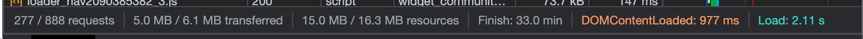
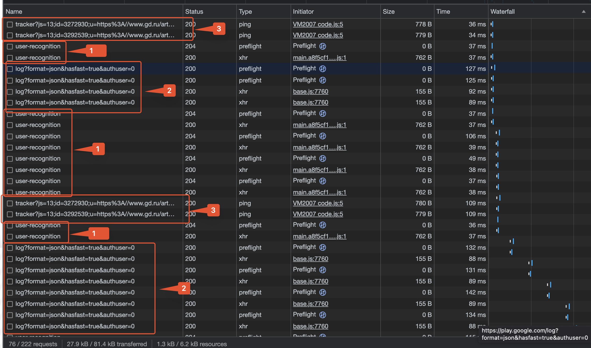
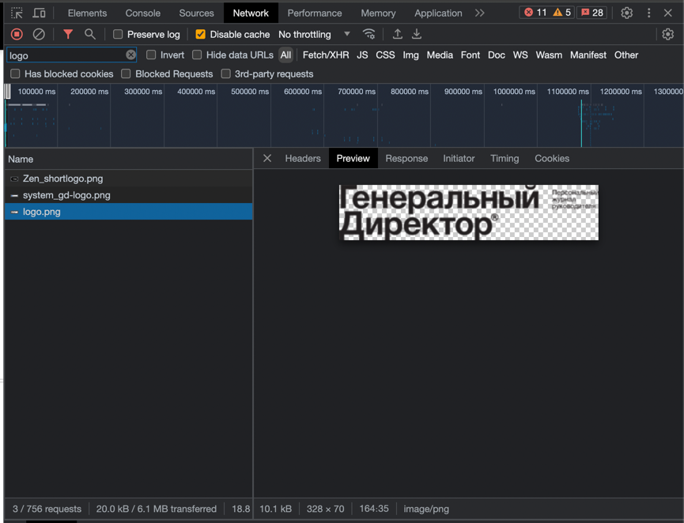
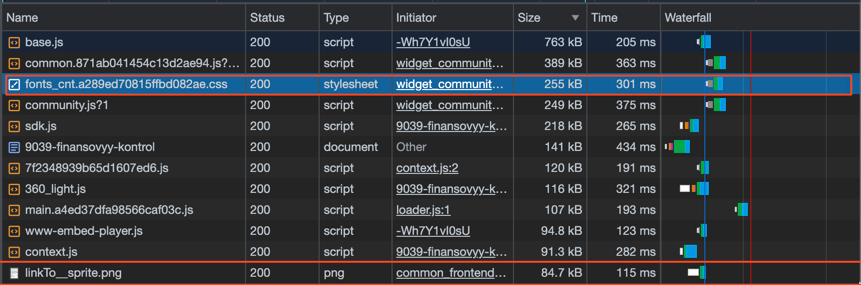
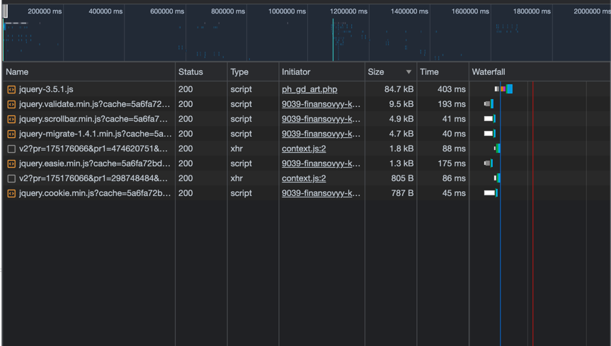
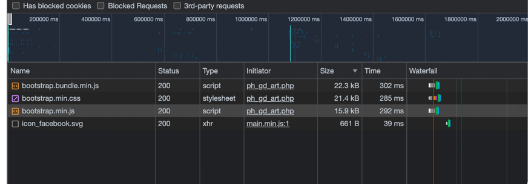
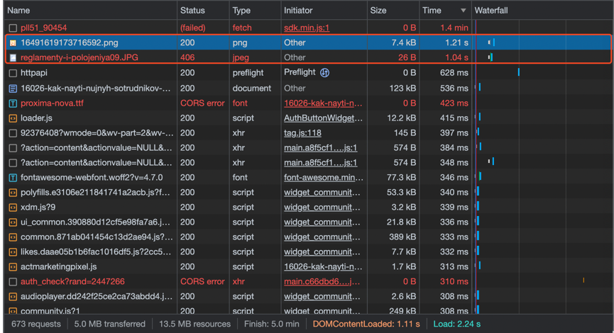
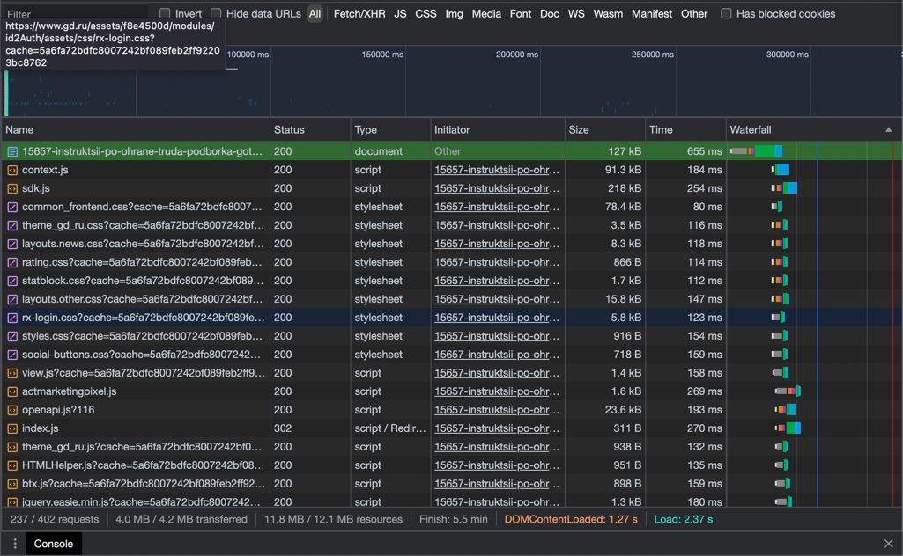
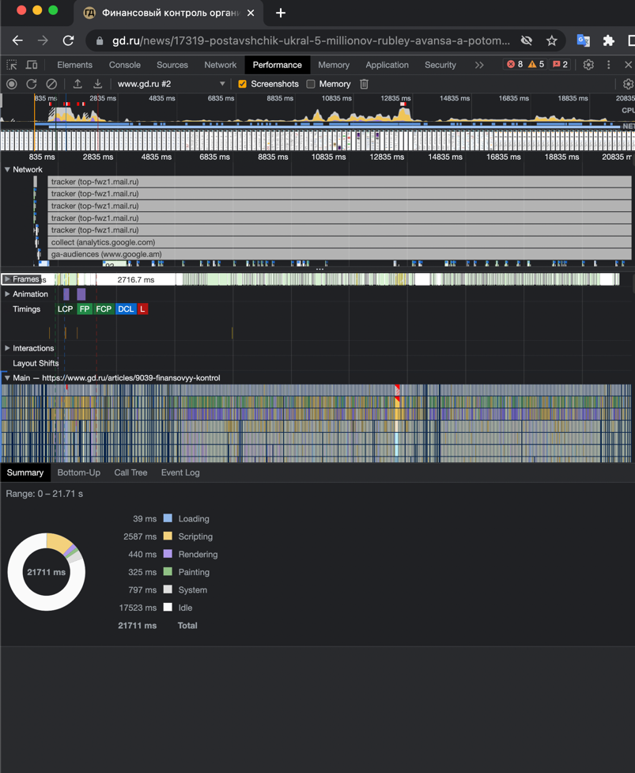

# ШРИ: Тулинг 2023 часть 2

## Общий комментарий

- Объем исходных данных на сайте составляет около 15 МБ, из которых около 5 МБ передано по сети. Сжатие данных
  произведено довольно хорошо. Общее время загрузки (Load) составило 2 секунды.

## 1 Tab network Google Chrome

### 1.1 [HAR файл](./www.gd.ru.har)

#### 1.2 Неоптимальные места

##### 1.2.1. Дублирование ресурсов. Можно заметить случаи, когда некоторые запросы к одним и тем же ресурсам происходят несколько раз без видимой причины.

Например:

Есть и другие примеры, но они не такие явные. Например, вот такой запрос:

- www.1cont.ru
- fontawesome-webfont.woff2

##### 1.2.2. Лишний размер ресурса

- Элементы графики используют растовые изображения, хотя могли бы использовать векторные.

- Большой размер JS и CSS файлов.
- 

##### 1.2.3. Медленно загружающиеся ресурсы
- Неоптимальное использование сторонних библиотек (например, jquery, которая весит 85kb, и bootstrap, которая весит более 250kb.

- часть запросов завершается ошибкой:

##### 1.2.4. Ресурсы, блокирующие загрузку
- Ресурсы, которые запускаются до того, как страница полностью загрузится. Например, вот такие запросы:

### 2. На вкладке Perfomance Google Chrome

#### 2.1. Профиль загрузки страницы [Performance JSON](./Trace-Perf.json)

#### 2.2. Измерение времени в миллисекундах от начала навигации до событий First Paint (FP), First Contentful Paint (FCP), Largest Contentful Paint (LCP), DOM Content Loaded (DCL), Load

- First Paint (FP) - 726.9 ms

- First Contentful Paint (FCP) - 726.9 ms

- Largest Contentful Paint (LCP) - 726.9 ms

- DOM Content Loaded (DCL) - 1047.7 ms

- Load - 2140.9 ms

#### 2.3. DOM-элемент на котором происходит LCP

- ``

#### 2.4. Время в ms тратится на разные этапы обработки документа (Loading, Scripting, Rendering, Painting)

- Loading - 39 ms
- Scripting - 2587 ms
- Rendering - 440 ms
- Painting - 325 ms

### 3. На вкладке Coverage

#### 3.1. Профиль загрузки страницы 

#### 3.2. Объём неиспользованного CSS в ходе загрузки страницы
- более 500 кб
- 
- 

#### 3.3. Объём неиспользованного JS в ходе загрузки страницы

- более 2000 кб
- 
- 
